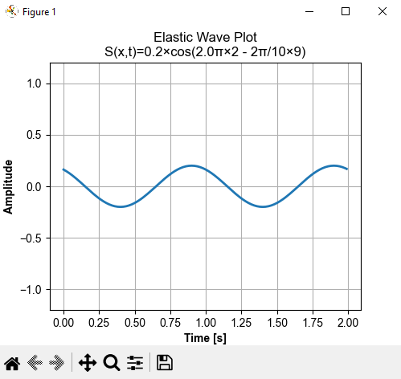
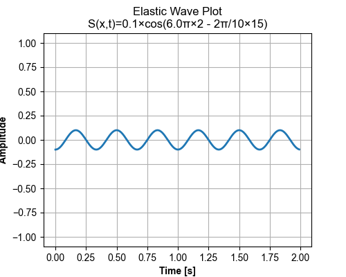

# Mechanic Wave

Waves - the process of oscillation, propagation in space over time.\
The main property of a wave: propagation without the transfer of matter.\
There are two types of perturbation orientations: longitudinal and transverse waves.\
The module provides for the use of only longitudinal waves and for determining the values of the plane (elastic) wave
equation.\
ONLY FOR ELASTIC MEDIA.

# Methods _MechanicWave_ class

1. **wavelength** - Determination of the wavelength **_[m]_**
2. **velocity** - To determine the speed of wave propagation **_[m/s]_**
3. **period** - To determine the wave period **_[s]_**
4. **periodicity** - To determine the wave periodicity **_[Hz or 1/s]_**
5. **omega** - To determine the wave omega **_[Hz or 1/s]_**
6. **phase** - To determine the wave phase

# _PlaneWave_ class:

Plane wave equation.\
Determination of displacement of a plane wave.\
The propagation of a wave is not accompanied by the transfer of matter.\
"Displacement (S)" - the displacement of the particle of the medium from the equilibrium position,\
at which "x" is the equilibrium position of the particle

# _DrawPlaneWavePlot_ graphic class:
# Method **show_plot()**:

# Method _save_plot()_:

# Requirements:

pip install requirements.txt
